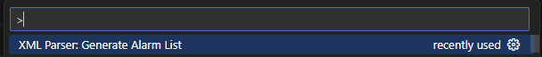

# XML Parser Drives

## Overview
**XML Parser Siemens Drives alarm List** is a tool designed to parse SINAMICS Alarm Lists. This utility helps in converting XML data into a more readable and manageable format.

## Features
- Parse SINAMICS Alarm Lists

## Installation
To install the extension, ensure you have Visual Studio Code version 1.80.0 or higher.

## Usage
Open the relevent XML Alarmlist
ctrl + shift + P
Then type xmlParser

## Contributing
If you would like to contribute to the project, please fork the repository and submit a pull request.

## License
This project is licensed under the MIT License.

## Contact
For any questions or issues, please contact the publisher at your-publisher-name.

## Repository
[Git Repository](https://github.com/ruban258/XML2CSVParserSianmicsDrives)

## Publisher
Gajaruban Jeyakumar

## Version
1.0.0

## Categories
- Other

## Engines
- VS Code: ^1.80.0